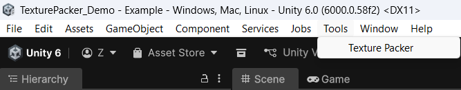
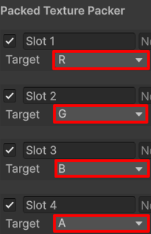
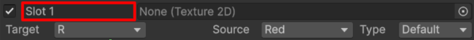
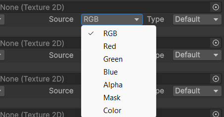
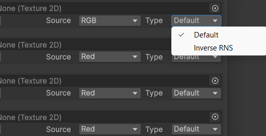
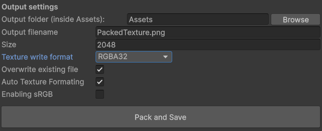

# Texture-Packer

### Texture Packer is a Unity editor plugin designed to pack multiple texture maps into different channels of a single texture.

For example, using RGB channels:

- R = Ambient Occlusion
- G = Metallic
- B = Mask

This approach helps save VRAM by using one texture instead of several separate ones.
Repository Contents

## The repository contains two main files:

- TexturePacker.cs: an editor script used to pack textures

- ShaderTest: a shader that supports packed textures generated by the plugin

## Plugin Location
The plugin is located in the Tools folder:

---

## Texture Slots
The plugin has four slots (unused slots can be disabled).
Each slot is assigned to a specific output channel, which can be selected manually.

---

> **Warning:**
> If two slots are assigned to the same channel, the data from the last slot will overwrite the previous one, since the packing process is linear.
> Changing slot names has no functional effect — they are purely cosmetic.

---

## Source & Type Settings

Each slot has two settings: Source and Type.

### Source:

Defines what data is written from the input texture into the selected output channel.
Available options (7 total):

---

- RGB: combines all RGB channels into one value

- R, G, B, A: reads data from the selected channel

- Mask: (experimental / alpha feature)
The idea was to store colors as bits, allowing up to three colors to be stored in a single channel and later decoded in a shader

- Color: fills the channel with a constant value (0–255)

### Type:

Defines how the data is processed before writing.
Available options (2 total):

---

- Default.
- Inverse RNS: inverts the value (originally designed for Roughness = Smoothness conversion)
  
## Output Settings

The first three options are self-explanatory:

---

### Additional settings:

- Texture Write Format: 
Defines the format used when writing data into the output texture

- Overwrite Existing File:
Overwrites the output file if it already exists

- Auto Texture Formatting:
Automatically selects texture compression based on the number of channels
(for example, 4 channels = BC7)

- Enable sRGB:
Enables sRGB color space (can also be set manually)

## Included Shader Information

The repository includes shaders designed to work with packed textures.
There are two supported workflows:

### 1️⃣ Packed Map Workflow:
The shader expects:

#### Albedo: standard albedo texture

---

#### Normal Map: must be set as Default, not Normal Map
- R = Normal X
- G = Normal Y
- B = Smoothness

---

#### Packed Map
- R = Ambient Occlusion
- G = Metallic
- B = Emission

---

### 2️⃣ Fully Packed Workflow (No Separate Packed Map):
All data is packed directly into Albedo and Normal textures:

#### Albedo Texture:
- RGB = Albedo RGB
- A = Ambient Occlusion

---

#### Normal Texture:
- R = Normal X
- G = Normal Y
- B = Smoothness
- A = Metallic or Emission

---
